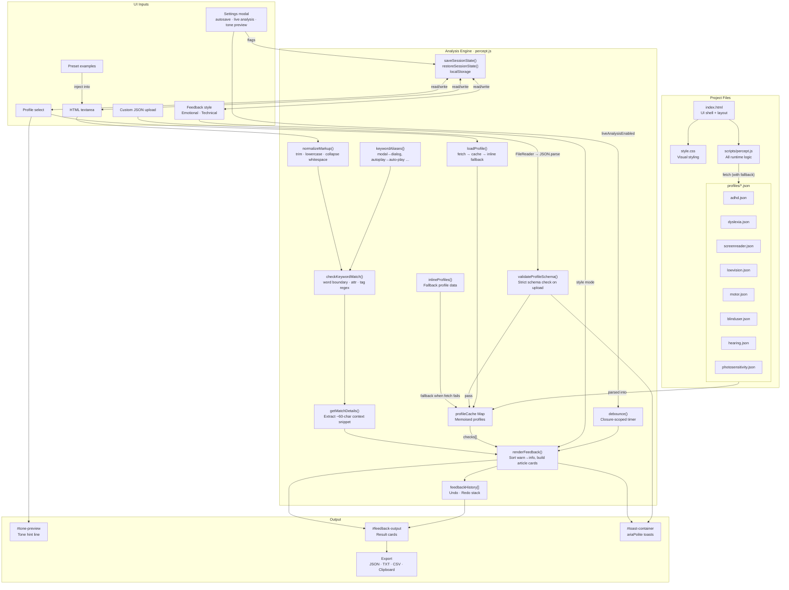

# Percept – Architecture Map

## Key data flows

**Profile load**
`select → loadProfile() → fetch profiles/*.json → profileCache → checks[]`
Falls back to `inlineProfiles{}` if the fetch fails. Custom uploads go through `validateProfileSchema()` before entering the cache.

**Analysis**
`textarea → normalizeMarkup() → checkKeywordMatch() (+ keywordAliases) → getMatchDetails() → renderFeedback() → result cards`

**Persistence**
`saveSessionState()` writes markup, profile, and style to `localStorage` on every change, gated by the autosave setting. `restoreSessionState()` reads them back on page load, clearing any stale profile key that no longer matches a valid option.
