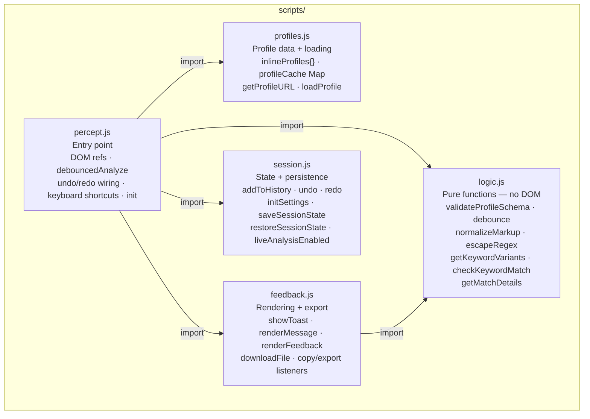
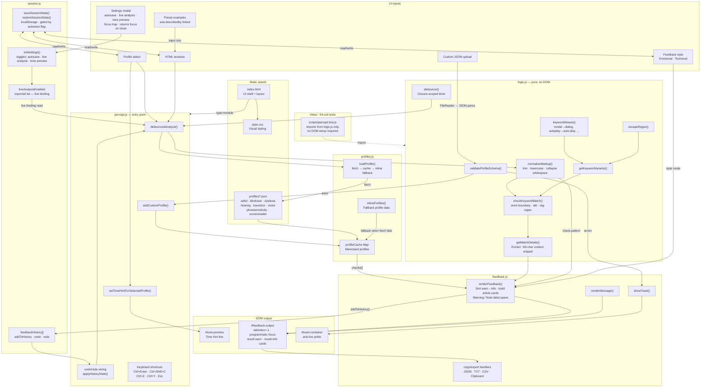

# Percept – Architecture Map

## Module structure

## Full data-flow

## Key data flows

**Profile load**
`select → loadProfile() → fetch profiles/*.json → profileCache → checks[]`
Falls back to `inlineProfiles{}` if the fetch fails (e.g. offline or `file://`). Custom uploads go through `validateProfileSchema()` in `logic.js` before entering the cache. Each check may specify a `keyword`, a `pattern` (regex string), or both.

**Analysis — keyword path**
`textarea → normalizeMarkup() → checkKeywordMatch() (+ keywordAliases) → getMatchDetails() → renderFeedback() → result cards`

**Analysis — pattern path**
`textarea → normalizeMarkup() → RegExp(check.pattern).test() → snippet from match → renderFeedback() → result cards`
Used when a keyword cannot express the condition — for example, detecting `` elements with no `alt` attribute at all via a negative lookahead: `]*\balt\s*=)[^>]*>`.

**Severity display**
Each card receives a `` as its first child, with text content `"Warning"` or `"Note"`. This is real DOM text, announced reliably by screen readers. Cards are further distinguished by left border weight (6 px warn, 4 px info) and color. Color alone is never the sole signal (WCAG 1.4.1).

**Persistence**
`saveSessionState()` writes markup, profile, and style to `localStorage` on every input change, gated by the autosave setting. `restoreSessionState()` reads them back on page load, clearing any stale profile key that no longer matches a valid option.

**Settings modal**
Opens with focus moved to the first focusable element inside the modal. Tab and Shift+Tab cycle within the modal. Escape and the close button return focus to `#settings-btn`.

**Feedback output**
`#feedback-output` carries `tabindex="-1"` so `feedbackBox.focus()` can move focus to the results region after analysis runs, without inserting it into the natural tab order.

**Module boundaries**
`logic.js` has no DOM access and no side-effects — it can be imported in any environment. `profiles.js` uses `fetch` and `window.location` but no direct DOM manipulation. `feedback.js` and `session.js` both acquire their own DOM references via `getElementById` at module load time (safe because all scripts are loaded as `type="module"`, which defers execution until the DOM is ready).
